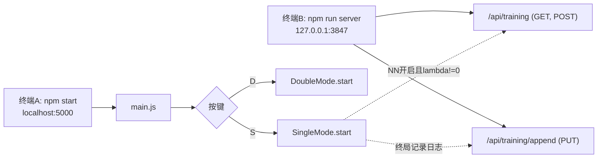
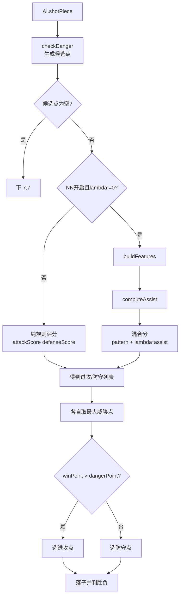

# 开发手册


## 1. 进程与端口分工

- 静态游戏与前端打包：`npm start`（`gulp default`），默认访问 `http://localhost:5000`。
- 训练 API：`npm run server`（`node server/index.js`），默认 `http://127.0.0.1:3847`。
- 两者相互独立：游戏可在不启动训练 API 的情况下运行；训练接口失败不会中断对局。

## 2. 启动与进入模式流程

入口在 `public/js/main.js`：按键选择模式。

- `S`：进入单人模式 `SingleMode.start()`。
- `D`：进入双人模式 `DoubliePlayerMode.start()`。



## 3. 单人模式主循环

`public/js/SingleMode.js` 的关键行为：

1. 初始化状态：`hasLoggedSingleResult`、`moveCountSingle`、棋盘数组与回合变量。
2. 若 `NN_ASSIST_ENABLED=true` 且 `NN_LAMBDA!=0`，开局调用 `nnAssist.preloadWeightsFromTrainingApi()` 尝试拉取权重。
3. 玩家点击落子：
   - 写入 `gameList`；
   - 检查胜负，若玩家胜则调用 `trainingApi.appendTrainingLog({...result:"win-user"...})`；
   - 未结束则切换回合并调用 `ai.shotPiece(...)`。
4. AI 落子完成后再次检查胜负，若 AI 胜则写 `result:"win-ai"` 日志。

## 4. AI 如何做判断（核心）

入口在 `public/js/AI.js` 的 `shotPiece(gameTurn, gameList)`。

### 4.1 候选点生成

- 先执行 `gameLogic.checkDanger()`，得到 `window.needComputePlace`。
- **说明**（实现见 `public/js/gameLogic.js`）：
  - `checkDanger()`：遍历棋盘，对每个**空位**检查其 **8 邻域**（上下左右 + 四斜）是否至少有一颗**已有棋子（黑或白均可）**；若是，则把该空位 `{ x, y }` 加入列表。因此不是「只考虑对手旁边」——**己方进攻延伸线上、贴着己方子的空位**同样会进入候选。
  - `window.needComputePlace`：全局数组，**每次**调用 `checkDanger()` 时会先清空再重新填充；`AI.js` 只对这些点调用 `getTheGameWeight` 等逻辑。名称含 “Danger”，与注释「检测威胁点」一致，但当前实现是**候选落子集合**而非单独筛「威胁棋形」。
- **设计取舍与局限**：这是为性能做的**启发式剪枝**。五子棋里绝大多数有效着手都在已有子附近，该集合通常已覆盖主要攻守；但若盘面上存在**与所有棋子都不 8 邻接的空位**（例如子力极度分散时，某步想落在「远离所有子的空区」），当前逻辑**不会**给这些点算分，也就选不到它们——唯一例外是整盘尚无邻接候选时回退天元 `(7,7)`。若将来要支持「远距离好点」，需要扩展候选生成（例如扩大邻域半径、合并己方最长连线的延伸点、或在候选过少时并入全盘点等），与算力成本权衡。
- 若候选为空，回退下天元 `(7,7)`。

**示例：候选点如何得到、又如何被选中**
假设当前盘面只有三枚子：黑 `(7,7)`、白 `(7,8)`、黑 `(8,8)`。遍历空位时，凡是与这三枚子任一枚在 **8 邻域**内的空位都会加入候选，例如：`(6,6)`、`(6,7)`、`(6,8)`、`(7,6)`、`(8,7)`、`(8,9)`、`(9,9)` 等；而像 `(0,0)` 这种远离已有子的空位不会进入候选。去重后得到 `window.needComputePlace`（顺序取决于遍历顺序）。这一步只统计“哪些点值得算分”，不直接决定“下哪里”。

window.needComputePlace对应的数据结构示例：
```js
window.needComputePlace = [
  { x: 6, y: 6 },
  { x: 6, y: 7 },
  { x: 6, y: 8 },
  { x: 7, y: 6 },
  { x: 8, y: 7 },
  { x: 8, y: 9 },
  { x: 9, y: 9 }
];
```

接着 `AI.js` 只遍历 `window.needComputePlace`：对每个候选点先“假设在该点落子”，再调用 `getTheGameWeight` 分别评估**进攻价值**（己方在此落子的收益）和**防守价值**（拦截对手威胁的收益）。

遍历过程中会维护两组“当前最优”：
  - `attackBest = { point, score }`：到目前为止进攻分最高的点；
  - `defenseBest = { point, score }`：到目前为止防守分最高的点。
    每处理一个候选点，就用该点分值与当前最优比较，若更高则更新对应最优点。

```js
// 初始
attackBest = { point: null, score: -Infinity };
defenseBest = { point: null, score: -Infinity };

// 处理 { x: 6, y: 6 } -> attack=120, defense=80
attackBest = { point: { x: 6, y: 6 }, score: 120 };
defenseBest = { point: { x: 6, y: 6 }, score: 80 };

// 处理 { x: 8, y: 7 } -> attack=110, defense=160
// attack 不更新；defense 更新为更高分
defenseBest = { point: { x: 8, y: 7 }, score: 160 };

// 处理 { x: 8, y: 9 } -> attack=180, defense=70
// attack 更新为更高分；defense 不更新
attackBest = { point: { x: 8, y: 9 }, score: 180 };
```

若开启 NN（且 `lambda != 0`），则在规则分基础上为每个候选构造特征并计算 `assist`，形成混合分 `weight = patternScore + lambda * assist`；更新最优点时使用这个混合后的分值。最后直接比较候选点里的`attackBest.score` 与 `defenseBest.score`：谁更高就下谁，从而在“主动做势/进攻”与“优先补防/拦截”之间做一次最终决策。

沿用上面的棋盘与候选集，NN 混合评分示例（演示值）：
```js
lambda = 0.5;

// 假设以下是“各候选在当前分支里的 patternScore 与 assist”
// { x: 8, y: 9 }: patternScore=180, assist=20  -> weight=180 + 0.5*20  = 190
// { x: 8, y: 7 }: patternScore=160, assist=70  -> weight=160 + 0.5*70  = 195
// { x: 6, y: 6 }: patternScore=120, assist=40  -> weight=120 + 0.5*40  = 140

// 混合后：
attackBest  = { point: { x: 8, y: 9 }, score: 190 };
defenseBest = { point: { x: 8, y: 7 }, score: 195 };

// 最终比较：195 > 190，因此本轮优先下 { x: 8, y: 7 }（防守优先）
```

对比两种算法之间的差异：
```js
// 不开 NN（或 lambda=0）时，比较的是纯 patternScore：
attackBest  = { point: { x: 8, y: 9 }, score: 180 }
defenseBest = { point: { x: 8, y: 7 }, score: 160 }
// 最终：180 > 160，选择 { x: 8, y: 9 }（进攻优先）

// 开启 NN（lambda=0.5）后，比较的是混合分：
attackBest  = { point: { x: 8, y: 9 }, score: 190 }
defenseBest = { point: { x: 8, y: 7 }, score: 195 }
// 最终：195 > 190，选择 { x: 8, y: 7 }（防守优先）
```

可见差异在于：NN 的 `assist` 会改变候选点之间的相对优势。在这个例子里，`(8,7)` 的 `assist` 更高，足以把原本略低的规则分“拉升”到第一，从而让最终决策由“偏进攻”切换为“先补防”。

### 4.2 两条评分分支

- 纯规则分支（NN 关闭或 `lambda=0`）：
  - 对每个候选点计算进攻分与防守分（`getTheGameWeight`）；
  - 分别取最大威胁点后比较，选更高者。
- NN 辅助分支（NN 开启且 `lambda!=0`）：
  - 先算规则分；
  - 构造特征向量 `buildFeatures(...)`；
  - 计算 `assist = nnAssist.computeAssist(features)`；
  - 混合评分：`weight = patternScore + lambda * assist`；
  - 同样比较“最大进攻点”与“最大防守点”来选最终落子。



### 4.3 评分量级观测方法

如果固定算法的评分系统量级差别过大，很有可能导致我们的NN辅助算法的功能几乎失效，为判断“规则分与 NN 辅助项是否量级匹配”，可以进入棋局与AI对战10-20局，根据输出的采样日志，来分析指标。

- NN 分支日志标签：`[AI][NN][metric]`
- 纯规则分支日志标签：`[AI][RULE][metric]`

1) **前二分差占比（gapRatio）**
- 指标：`attackGapRatio` / `defenseGapRatio`（或 NN 分支中的 `...Mixed` 与 `...Pattern`）
- 含义：`(Top1 - Top2) / Top1`，越大表示第一名优势越“碾压”
- 经验判据：
  - 长期 `> 0.30`：规则分可能过陡，候选排序几乎固定
  - 常见 `0.05 ~ 0.20`：通常较健康
  - 长期 `< 0.03`：评分可能偏平，容易出现抖动

2) **NN 增益占比（bumpRatio）**
- 指标：`avgBump`、`avgBumpRatio`（其中 `bump = lambda * assist`）
- 含义：NN 项相对于规则分的平均影响强度
- 经验判据：
  - 多数 `< 0.1%`：NN 几乎不影响排序
  - 常见 `0.5% ~ 3%`：可在“接近分差”候选上产生有效微调
  - 频繁 `> 10%`：NN 可能过强，需防止压过规则战术

3) **是否改判（flipByNN）**
- 指标：`flipByNN`（同一步里“纯规则选点”与“混合分选点”是否不同）
- 含义：NN 是否真正改变了最终决策
- 经验判据：
  - `< 2%`：NN 基本无效
  - `5% ~ 20%`：通常是较合理的辅助强度
  - `> 35%`：NN 影响偏大，需关注稳定性

4) **分阶段观测（推荐）**
- 结合 `stonesOnBoard` 分桶看趋势：开局（`0~30`）/中盘（`31~90`）/后盘（`91+`）
- 一般期望：开局允许一定改判，后盘改判率下降（战术杀棋应更多由规则分主导）

结论判读示例：
- 若同时出现“`gapRatio` 偏高 + `avgBumpRatio` 很低 + `flipByNN` 接近 0”，通常说明**规则分本身可用，但与 NN 尺度不匹配，NN 辅助实际未生效**。

### 4.4 本次 `lambda` 调整复盘（原因、过程、结论）

本节记录一次完整的 `NN_LAMBDA` 调参案例，作为后续同类问题的参考模板。

**调整原因**

- 现象：开启 NN 后，体感落子与纯规则 AI 几乎一致。
- 证据：观测日志里 `flipByNN` 长时间接近 0，`Mixed` 与 `Pattern` 的 gapRatio 基本重合。
- 根因：当前实现中 `assist` 来自 sigmoid 输出，范围约 `(0,1)`；混合项为 `bump = lambda * assist`。当 `lambda=0.08` 时，`bump` 只有小数级，难以影响规则分排序（规则分常在几十到上万量级）。

**调整过程**

1. 先补齐观测能力：在 `AI.js` 增加 `gapRatio`、`avgBumpRatio`、`flipByNN` 指标日志。  
2. 将日志持久化到服务端：新增 `PUT /api/log/append`，把每步指标写入 `data/log.log`（每行一条 JSON）。  
3. 基线采样（旧参数）：`NN_LAMBDA=0.08` 时，`avgBumpRatio` 约为万分位，`flipByNN` 近似 0，确认 NN 基本未生效。  
4. 参数调整：把 `config.js` 的 `NN_LAMBDA` 从 `0.08` 提升到 `80`，并同步更新注释建议区间。  
5. 再采样验证：观察 `data/log.log` 中同样指标，确认是否进入“可见但不过强”的区间。

**本次结果**

- 调整后（`lambda=80`）日志显示：
  - `avgBump` 稳定在约 `58~60`；
  - `avgBumpRatio` 进入可见区间（明显高于旧参数）；
  - 单局出现少量 `flipByNN=true`（例如约 `2/19`），说明 NN 已能在部分回合改变最终选点。
- 结论：相较旧参数，NN 已从“几乎无效”提升到“可参与决策”。

**经验总结**

- 不要只凭体感调参，必须先看三指标：`avgBumpRatio`、`flipByNN`、`gapRatio`。  
- 若出现“`avgBumpRatio` 极低 + `flipByNN≈0`”，优先考虑**量级失配**而非网络失效。  
- `lambda` 建议用阶梯法：基线 -> 中档 -> 高档（每档固定局数采样），避免一次拉满。  
- 目标状态通常是：NN 能在“接近分差”局面改判，但在明显杀棋/必防局面不抢主导。  
- 当前项目在此轮验证后，`lambda=80` 可作为后续实验起点；若后续出现过度改判，再回调到 `50~70` 区间复测。

## 5. 神经网络与训练基础（概念）

本节说明：在本项目里，**神经网络扮演什么角色**、**权重是什么**、**「训练」在本仓库里具体指哪种算法**，以及它与**规则 AI** 如何配合。

### 5.1 神经网络在做什么（推理）

- **直观理解**：把当前局面的一小段**数值信息**（**特征向量**，本项目里由 `buildFeatures` 得到）送进一个**固定结构的计算图**：每层对输入做**加权求和**，再经**激活函数**（非线性）得到下一层，最后输出一个（或多个）数。

与本项目网络形状一致的**数据流示意**（数字为各层向量长度；连线表示带权汇总，隐层在汇总后做激活）：


- **图中「6 维」各表示什么**：网络**每一步评估**只针对**当前候选落子点** `(x,y)`，把这点的上下文压成 6 个数（顺序固定，见 §6 / `nnFeatures.js`）：
  1. **`nx`、`ny`**：落子在棋盘上的**位置**（列、行归一化到约 `[-1,1]`），让网络能区分角、边、中心等空间差异。  
  2. **`attackNorm`、`defenseNorm`**：该点在**规则 AI 眼里**的**进攻强度**与**防守强度**（由棋形分缩放、裁剪得到），等于把「规则已经算好的威胁信息」再交给 NN 做二次组合。  
  3. **`candCountNorm`**：当前局面**候选点大概有多少**（战场宽窄），帮助区分「局部纠缠」与「选择面较大」的局面。  
  4. **`moveProgress`**：**全局已下子比例**（开局 / 中盘 / 残局），让同一棋形在不同阶段可以有不同的辅助倾向。  
  合起来：6 维 = **在哪下、规则攻守多强、局面多挤、下到哪一阶段**，是「给 NN 的摘要」，不是棋盘全图。

- 图中「隐层 4 个神经元」是网络内部的 **4 个中间通道**：每个神经元都把 **6 维输入各自做一套加权求和，再经激活（非线性）**，得到 4 个中间值；这 4 个数再汇总成最后的 **`assist` 标量**。  
  - **意义**：在「输入信息」和「最终 assist」之间留一层可学习的**非线性组合**，容量比「6 维直接线性变 1 个数」略大，算力仍很小。  
  - **为什么是 4（不是 6、也不是别的数）**：隐层有几个神经元，**不是从特征维数推出来的公式结果**，而是实现时人为定的**网络规模**：神经元越多，**可调的连接权重越多**，理论上更能拟合复杂关系，但**每步算得更慢**、进化时**每个个体参数更多**、在「只靠对局胜负反馈」的设置里也**未必更好**。取 **4** 表示：在「几乎不占主流程算力、只当规则分上的小修正」这一前提下，给网络留一点**非线性组合能力**；若改成 2、8、16 等也可以，都属于换一套规模。**一旦改掉这个数字**，存下来的权重矩阵行列数全变，**旧权重文件就不能再直接加载**，所以代码里要用 **`nnAssistSchemaVersion` 等约定**让前端、进化脚本、JSON 里保存的形状**三方一致**，避免「结构是 6→8→1、文件里却是 6→4→1」这种 silently wrong。

- **权重（weights）**：各层之间的连接强度等参数，**存成数字**；**换一套权重 = 换一套「从特征到输出」的映射**。游戏里的 `GET /api/training` 拉取的主要就是这类参数 + 版本信息，用于在浏览器里**复现**与训练端一致的那张网。  
- **前向传播**：从输入算到输出、**不改动权重**的过程。对局里 AI 每次 `computeAssist` 只做前向传播，**不叫「训练」**。

### 5.2 「训练」在优化什么

- **目标**：找到一组权重，使网络在**你关心的任务**上表现更好（例如赢棋更多、得分更高）。  
- **常见路线（监督学习）**：有大量「输入 + 正确答案」样本，用**反向传播 + 梯度下降**逐步调权重。本项目**没有**把棋谱做成大规模标注数据集走这条主路径。  
- **本项目主路径（神经进化）**：把**整张网络的权重**当成「生物基因」，维护**种群**（多组不同权重）；让每个个体去下若干盘棋，用**胜负/得分**算**适应度**；**一代一代**做**选择、交叉、变异**，让平均适应度上升。不依赖棋步标签，依赖**与环境的对局结果**。  
- **与仓库脚本的关系**：`npm run evolve` 等在 Node 里跑的就是这类**离线进化**；产物是新的权重，再通过 `POST /api/training` 等方式写回训练仓库供游戏 `GET` 加载。

### 5.3 本项目中「规则 AI」与「NN 辅助」的分工

- **规则分**（`getTheGameWeight`）：基于棋形规则的标量，可解释、稳定。  
- **NN 输出**（`assist`）：对同一候选点的**额外标量微调**。  
- **混合**：`patternScore + λ * assist`。`λ=0` 时 NN 不参与，行为与纯规则一致；`λ` 过大时 NN 项会压过或扭曲规则分，可能出现**弱棋、不符合棋形直觉的着手**，一般宜从小 `λ` 逐步试，并在开启 NN 时仍把规则分作为主信号。

## 6. NN 输入特征与网络形状

定义在 `public/js/nnFeatures.js`。

- 特征维度：`FEATURE_DIM = 6`
- 隐层配置：`NN_ASSIST_HIDDEN = [4]`
- 网络形状：`[FEATURE_DIM, NN_ASSIST_HIDDEN, 1]`

当前 6 维特征：

补充：这里的“归一化”指把原始值压到更统一的范围（常见是 `[-1,1]` 或 `[0,1]`），减少不同量纲之间的尺度差异，便于网络稳定计算。  
以 `nx` 为例：`nx = (x - 7) / 7`，所以 `x=0 -> nx=-1`，`x=7 -> nx=0`，`x=14 -> nx=1`；`ny` 同理。
`clamp` 是限幅函数：`clamp(v, lo, hi)`。若 `v < lo` 返回 `lo`；若 `v > hi` 返回 `hi`；否则返回 `v`。  
实现代码（与 `public/js/nnFeatures.js` 一致）：

```javascript
function clamp(v, lo, hi) {
  if (v < lo) return lo;
  if (v > hi) return hi;
  return v;
}
```

实现原理：本质是一个三分支比较器，先判断是否低于下界，再判断是否高于上界，最后返回区间内原值；时间复杂度 `O(1)`、无副作用。  
等价数学表达：`clamp(v, lo, hi) = min(max(v, lo), hi)`，先把值抬到不小于 `lo`，再压到不大于 `hi`。
在本项目里它是归一化后的“安全护栏”：避免极端分数或异常值把输入拉出预期区间，提升 NN 计算稳定性。

1. `nx`：列坐标归一化。  
   公式：`nx = (x - 7) / 7`，`x ∈ [0,14]` 时 `nx ∈ [-1,1]`。
2. `ny`：行坐标归一化。  
   公式：`ny = (y - 7) / 7`，`y ∈ [0,14]` 时 `ny ∈ [-1,1]`。
3. `attackNorm`：进攻分归一化。  
   公式：`attackNorm = clamp(attackScore / 1e6, -1, 1)`。
   说明：当前实现里 `attackScore` 基本非负，所以实际值通常落在 `[0,1]`；`-1` 下界主要是为后续可正可负的评分特征预留（例如引入惩罚项或差分特征时可直接兼容）。
4. `defenseNorm`：防守分归一化。  
   公式：`defenseNorm = clamp(defenseScore / 1e6, -1, 1)`。
   说明：当前实现里 `defenseScore` 也基本非负，实际多为 `[0,1]`；保留 `-1` 下界属于通用对称区间设计，和 `nx/ny` 的 `[-1,1]` 习惯保持一致。
5. `candCountNorm`：候选点规模归一化。  
   公式：`candCountNorm = clamp(candidateCount / 50, 0, 1)`。
6. `moveProgress`：棋局进度（已下子数 / 225）。  
   公式：`moveProgress = clamp(stonesOnBoard / 225, 0, 1)`。

说明：`nnAssist.js`、`scripts/evolve-ai.js`、`scripts/verify-nn-lambda-effect.js` 已统一引用这组定义，避免魔数漂移。

## 7. 训练数据与权重读写

前端封装在 `public/js/trainingApi.js`：

- `GET /api/training`：从训练仓库读取 JSON（游戏侧主要用来取 **NN 辅助权重** 及配套版本信息）。
- `PUT /api/training/append`：追加单局日志 entry。
- 任何请求失败都返回安全值，不阻断对局。

三个接口对应同一份「训练仓库」`data/ai-training.json` 的三种业务动作（训练服务与游戏页面分进程/分端口运行时，通过它们读写这份仓库）：

### `GET /api/training`（读取 NN 权重等配置）

- **业务含义**：从训练仓库**只读**取出当前保存的内容。对游戏而言，**主要用途就是拿「神经网络辅助落子」要用的数据**——也就是**权重**（以及例如 `nnAssistSchemaVersion` 这类**判断是否可加载、是否与当前网络结构匹配**的配套信息）。  
- **说明**：接口返回的是**整份仓库 JSON**，里面往往还会带上对局流水等其它字段；**和 NN 直接相关、游戏会去用的，就是其中的权重与版本类字段**，其余字段是否参与逻辑由产品决定。  
- **若没有仓库或暂不拉取**：视为**没有可用的远程权重**，NN 辅助仍可用内置默认网；**拉取失败**时同样不强行依赖远程权重，对局继续。

### `POST /api/training`（整表替换）

- **业务含义**：用你提供的一份 JSON，**整体替换**仓库里的快照——相当于**发布新配置**、**整包导入**或**整表重置**。
- **典型场景**：离线进化或整理完成后，**一次性写入**新权重与版本，以及你希望文件根上出现的所有字段。
- **业务注意**：这是**整份替换，不是与旧文件合并**。新快照里没带的根级信息（例如之前的对局流水、其它元数据），在业务上视为**随旧快照一起被取代**。若既要更新权重又要保留日志，应在业务侧先拼好**完整**快照再 `POST`，对局流水仍建议用下面的「追加」接口持续积累。

### `PUT /api/training/append`（追加一条流水）

- **业务含义**：在仓库的 **`records` 流水**里**多记一条**（如单局结果：胜负、手数、时间等），**不要求**每次提交整份仓库。
- **典型场景**：每打完一局自动上报一条，供后续统计、再训练或复盘；与「整表替换」分工明确，避免每局都走全量发布。
- **业务注意**：每条会附带服务端记录的时间，与业务方传入的 `entry` 字段一起形成一条流水；一般不用于「改权重」——权重仍以 `GET` 读取、`POST` 整表发布为主。

## 8. 典型联调方式（推荐）

1. 终端 A：`npm run server`。
2. 终端 B：`npm start`。
3. 浏览器打开 `http://localhost:5000`，按 `S` 进入单人模式。
4. 观察：
   - Network 中 `GET /api/training`（NN 开启且 lambda 非零时）；
   - 对局结束后 `PUT /api/training/append`；
   - `data/ai-training.json` 的 `records` 递增。

## 9. 常见问题快速判断

- 看不到 NN 影响：检查 `config.js` 中 `NN_ASSIST_ENABLED` 与 `NN_LAMBDA`。
- 有训练请求警告：确认训练服务是否已启动在 3847。
- 想恢复纯规则 AI(不使用神经网络辅助)：设 `NN_ASSIST_ENABLED=false` 或 `NN_LAMBDA=0`。
- 权重不生效：检查 `ai-training.json` 根级 `nnAssistSchemaVersion` 与 `nnAssistWeights.neurons` 是否匹配 `[6,4,1]`。
