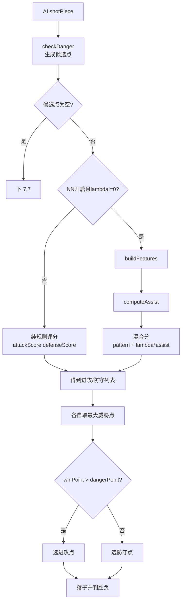

# 项目运行与 AI 决策流程

本文面向开发与联调，说明 GoBang 项目从启动到单人对局，再到 AI 决策与训练数据读写的完整路径。

## 1. 进程与端口分工

- 静态游戏与前端打包：`npm start`（`gulp default`），默认访问 `http://localhost:5000`。
- 训练 API：`npm run server`（`node server/index.js`），默认 `http://127.0.0.1:3847`。
- 两者相互独立：游戏可在不启动训练 API 的情况下运行；训练接口失败不会中断对局。

## 2. 启动与进入模式流程

入口在 `public/js/main.js`：按键选择模式。

- `S`：进入单人模式 `SingleMode.start()`。
- `D`：进入双人模式 `DoubliePlayerMode.start()`。

```mermaid
flowchart LR
    A[终端A: npm start\nlocalhost:5000] --> B[main.js]
    B --> C{按键}
    C -->|S| D[SingleMode.start]
    C -->|D| E[DoubleMode.start]

    F[终端B: npm run server\n127.0.0.1:3847] --> G[/api/training GET POST]
    F --> H[/api/training/append PUT]

    D -.NN开启且lambda!=0.-> G
    D -.终局记录日志.-> H
```

## 3. 单人模式主循环

`public/js/SingleMode.js` 的关键行为：

1. 初始化状态：`hasLoggedSingleResult`、`moveCountSingle`、棋盘数组与回合变量。
2. 若 `NN_ASSIST_ENABLED=true` 且 `NN_LAMBDA!=0`，开局调用 `nnAssist.preloadWeightsFromTrainingApi()` 尝试拉取权重。
3. 玩家点击落子：
   - 写入 `gameList`；
   - 检查胜负，若玩家胜则调用 `trainingApi.appendTrainingLog({...result:"win-user"...})`；
   - 未结束则切换回合并调用 `ai.shotPiece(...)`。
4. AI 落子完成后再次检查胜负，若 AI 胜则写 `result:"win-ai"` 日志。

## 4. AI 如何做判断（核心）

入口在 `public/js/AI.js` 的 `shotPiece(gameTurn, gameList)`。

### 4.1 候选点生成

- 先执行 `gameLogic.checkDanger()`，得到 `window.needComputePlace`。
- 若候选为空，回退下天元 `(7,7)`。

### 4.2 两条评分分支

- 纯规则分支（NN 关闭或 `lambda=0`）：
  - 对每个候选点计算进攻分与防守分（`getTheGameWeight`）；
  - 分别取最大威胁点后比较，选更高者。
- NN 辅助分支（NN 开启且 `lambda!=0`）：
  - 先算规则分；
  - 构造特征向量 `buildFeatures(...)`；
  - 计算 `assist = nnAssist.computeAssist(features)`；
  - 混合评分：`weight = patternScore + lambda * assist`；
  - 同样比较“最大进攻点”与“最大防守点”来选最终落子。



## 5. NN 输入特征与网络形状

定义在 `public/js/nnFeatures.js`。

- 特征维度：`FEATURE_DIM = 6`
- 隐层配置：`NN_ASSIST_HIDDEN = [4]`
- 网络形状：`[FEATURE_DIM, NN_ASSIST_HIDDEN, 1]`

当前 6 维特征：

1. `nx`：列坐标归一化。
2. `ny`：行坐标归一化。
3. `attackNorm`：进攻分归一化。
4. `defenseNorm`：防守分归一化。
5. `candCountNorm`：候选点规模归一化。
6. `moveProgress`：棋局进度（已下子数 / 225）。

说明：`nnAssist.js`、`scripts/evolve-ai.js`、`scripts/verify-nn-lambda-effect.js` 已统一引用这组定义，避免魔数漂移。

## 6. 训练数据与权重读写

前端封装在 `public/js/trainingApi.js`：

- `GET /api/training`：拉取整块训练 JSON。
- `PUT /api/training/append`：追加单局日志 entry。
- 任何请求失败都 `catch + warn`，并返回安全值，不阻断对局。

服务端在 `server/index.js`：

- `GET /api/training`：读取 `data/ai-training.json`。
- `POST /api/training`：覆盖写整块 JSON（会加 `savedAt`）。
- `PUT /api/training/append`：向 `records[]` 追加日志条目。

## 7. 典型联调方式（推荐）

1. 终端 A：`npm run server`。
2. 终端 B：`npm start`。
3. 浏览器打开 `http://localhost:5000`，按 `S` 进入单人模式。
4. 观察：
   - Network 中 `GET /api/training`（NN 开启且 lambda 非零时）；
   - 对局结束后 `PUT /api/training/append`；
   - `data/ai-training.json` 的 `records` 递增。

## 8. 常见问题快速判断

- 看不到 NN 影响：检查 `config.js` 中 `NN_ASSIST_ENABLED` 与 `NN_LAMBDA`。
- 有训练请求警告：确认训练服务是否已启动在 3847。
- 想恢复纯规则 AI：设 `NN_ASSIST_ENABLED=false` 或 `NN_LAMBDA=0`。
- 权重不生效：检查 `ai-training.json` 根级 `nnAssistSchemaVersion` 与 `nnAssistWeights.neurons` 是否匹配 `[6,4,1]`。
